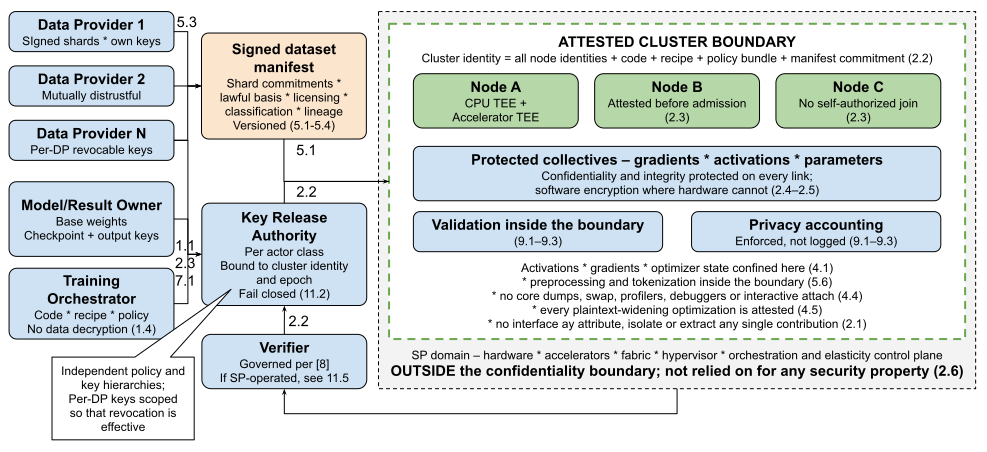
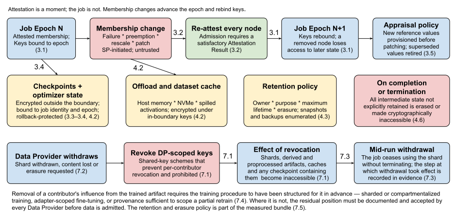
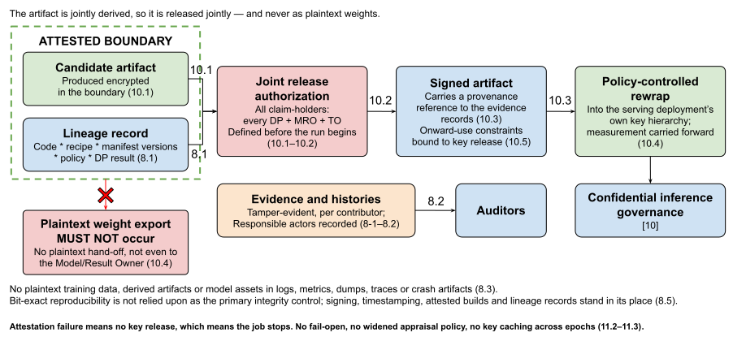

# 
# Confidential Training Governance

# Context

A properly governed AI Training Service (AITS) must be subjected to a set of Confidential Computing-specific Control Objectives in order to satisfy the requirements of each Persona **[1]**.

This pattern applies when building or operating a service that trains, fine-tunes or otherwise fits a machine learning model, and the data used for that training cannot be disclosed in plaintext to the party operating the compute, to the party that will own the resulting model, or — in the
multi-party case — to the other parties contributing data.
In these situations it is common to encounter one or more of the following:

* Data being pooled across business units subject to different regulatory regimes
* Customer or patient data under contractual or statutory restrictions
* Several institutions wishing to train jointly on their combined data without disclosing it to one another
* Fine-tuning a third-party model whose weights are themselves confidential
* A model supplier who wishes to train in a hosted environment without exposing weights, architecture or training recipe to the hosting provider

Owners of confidential workloads implementing AITSs need to understand what controls related to data-in-use protections must be deployed as part of and alongside such services.
Several classes of actors are involved in supplying data, orchestrating, hosting and consuming the output of a training run, and the members of these classes do not fully trust members of other classes.
Data-in-use protections can help meet these expectations while keeping the required trust relationships to a minimum.

This pattern assumes that the training runtime is itself a Confidential Workload and that the controls of the Confidential Workload Governance pattern **[7]** have been applied to it, including secure build, supply chain and dependency management, TCB minimization, and root-store and cryptography hygiene.
It further assumes the existence of a properly governed Verifier per Verifier Governance pattern **[8]**, and that any data ingestion gateway, feature store front-end or aggregation proxy in the path is governed as a Trusted Intermediary per the Proxy and Gateway Governance pattern **[9]**.
Where the model produced by a run is subsequently served, Confidential Inference Governance pattern **[10]** governs that phase; this pattern governs the production of the artifact and its hand-off, not its use.

# Problem

A training run concentrates, into a single long-running computation:

1. Plaintext data from parties who will not disclose it to one another
2. A model artifact that may be confidential
3. An execution environment operated by a party trusted with neither

Unlike inference, the computation is not a short request: it runs for days or weeks, across many nodes and accelerators, with frequent persistence of intermediate state, and it produces an output artifact that durably encodes information derived from every contributor's data.

The governance problem is to define the minimum and sufficient controls needed to assure the confidentiality and integrity of training data, model assets and intermediate state across a distributed, elastic, long-running computation, and to govern the provenance, release and subsequent use of the artifact that computation produces.

## Roles

| Role | Description and Trust Relationships |
| :---- | :---- |
| **Data Provider (DP)** | Contributes training data and owns the obligations attaching to it. Controls the keys wrapping its shards and the policy governing their use, retention and erasure. A DP trusts the attested job identity directly, and trusts neither the SP, the TO, the MRO, nor peer DPs with its plaintext. In the multi-party case there are several mutually distrustful DPs. |
| **Training Orchestrator (TO)** | Defines and submits the training job: code, recipe, data mixture and policy. Declares the expected job identity. The TO is trusted to define the computation but is **not** necessarily trusted with plaintext data; where the TO is also a DP or the MRO, that collapse of roles **MUST** be documented. |
| **Model/Result Owner (MRO)** | Owns the base model where one exists and owns or co-owns the output artifact. Controls the keys wrapping base weights, checkpoints and the output artifact. Concerned with model confidentiality, artifact integrity and authorized release. Trusts the attested job identity directly and the SP transitively and minimally. |
| **Service Provider (SP)** | Operates the hosting infrastructure, accelerators, fabric and orchestration control plane, decomposed into System Operator, Service and Tenant roles where those are distinct. Expected to provide physical security, timely patching and platform operation. **Not** trusted with plaintext data, intermediate state or model assets, and **MUST NOT** be the sole gate for key release. |
| **Aggregator (AG)** | Where training is federated or split across trust domains, the party combining contributions from multiple participants. Trusted for availability and correct combination but **MUST NOT** be trusted with individual plaintext contributions where secure aggregation is required **[13]**. |
| **Verifier (V)** | Appraises Evidence produced by each participating node and issues Attestation Results. Governed per **[8]**. DPs and the MRO trust the Verifier Tenant directly; where the Verifier Service is operated by the SP, the residual exposure described in **[8]** applies. |
| **Key Release Authority (KRA)** | Releases cryptographic keys used to wrap data, base-model, checkpoint and output-artifact keys, contingent on satisfactory Attestation Results and policy evaluation. May be instantiated separately per actor class. |
| **Auditors** | Require evidence of what was trained, on what data, under what recipe and policy, without being granted access to the data itself. |

In certain cases these roles can be combined.
A single enterprise training on its own data may combine DP, TO and MRO; a model supplier fine-tuning on a customer's data separates DP from MRO.
Each combination collapses a trust boundary and **MUST** be documented as such.

## Assets

Integrity is required for every asset listed below, and the availability of each asset is assumed to be mandatory for the correct functioning of the training service.
The `RC` column indicates whether the asset **R**equires **C**onfidentiality.
The list assumes a multi-party or multi-tenant training service; the single-party case is the trivial case and is covered implicitly.

| Asset | Role | Description of the Asset | RC |
| :---- | :---: | :---- | :---: |
| **Training System** | SP | Physical hardware, firmware, accelerators, fabric, hypervisor and optionally the host operating system on which the training job executes | N/A |
| **Orchestration and scheduling control plane** | SP | Cluster scheduler, job queue, elasticity controller and node lifecycle management; outside the confidentiality boundary | No |
| **Training runtime software** | TO | Deployed executable code constituting the training stack: framework, kernels, collectives library, data loader, optimizer and checkpointing logic | No |
| **Training recipe and configuration** | TO / MRO | Hyperparameters, curriculum, data mixture weights, objective, optimizer settings and schedule, *excluding* cryptographic keys | Opt |
| **Training data shards** | DP | The raw records contributed by each Data Provider, in motion and at rest | Yes |
| **Derived data artifacts** | DP / TO | Tokenized, normalized, deduplicated, shuffled or embedded forms of contributed data, and any feature-store materialization | Yes |
| **Dataset manifest and provenance record** | DP / TO | Cryptographic commitments to the contents of each shard, together with licensing, consent, lineage and classification metadata | Opt |
| **Activations and gradients** | DP | Per-step intermediate values, including those traversing inter-node collectives; recoverable to inputs under known attacks **[11]** | Yes |
| **Optimizer state** | MRO | Moments, scalers and other per-parameter state persisted alongside weights | Yes |
| **Checkpoints** | MRO | Periodic full or sharded persistence of weights and optimizer state enabling restart | Yes |
| **Base model weights and adapters** | MRO | Pre-trained parameters being fine-tuned, and any adapters produced | Yes |
| **Output model artifact** | MRO | The trained or fine-tuned weights, adapters and architecture produced by the run | Yes |
| **Privacy accounting state** | DP / TO | Differential privacy budget, noise parameters and accountant state where DP is applied **[12]** | Opt |
| **Training telemetry** | TO | Loss curves, gradient norms, per-shard metrics, evaluation results and profiler output | Opt |
| **Job topology and cluster identity** | TO / SP | The attested membership of the set of nodes constituting one training job, and its epoch | No |
| **Training evidence records** | DP / MRO | Tamper-evident, policy-bound records of which data, recipe and code produced which artifact | Opt |
| **Actor key material** | DP / MRO / TO | Wrapping, signing and session keys controlled independently by each actor class | Yes |
| **Attestation Evidence and Attestation Results** | SP / TO | Evidence produced by each participating node and the corresponding Attestation Results relied upon for key release | Opt |

## Summary of Concerns

The problem is not solved by encrypting the dataset.
It is about whether plaintext data, intermediate state and model assets can be confined to a verifiable confidentiality boundary that spans many nodes and persists for the duration of a long run; whether the inputs to that run are what they are claimed to be; whether the artifact it produces can be released only to authorized parties; and whether the information the artifact unavoidably encodes about contributors' data is governed rather than ignored.
The concerns that must be addressed are:

1. Pooling plaintext data from multiple mutually distrustful Data Providers inside one computation without disclosing any contribution to any other party
2. Maintaining a single confidentiality boundary across a distributed, multi-node, multi-accelerator job whose internal traffic carries data-derived values
3. Preserving the integrity of the boundary across a long-running, elastic job whose node membership changes through failure, preemption, rescaling and restart
4. Protecting the intermediate and persisted state — activations, gradients, optimizer state and checkpoints — that resilience and scale require the system to create
5. Establishing the provenance, licensing basis, classification and integrity of training data that is too large and too dynamic to be measured as a static image
6. Governing the information about training data that the output artifact itself encodes, and the leakage channels through gradients, telemetry and evaluation output
7. Honoring revocation, withdrawal of consent and erasure obligations against a computation whose output cannot simply be decrypted and edited
8. Proving to Auditors and Data Providers what was trained on what, under which recipe and policy, without exposing the data
9. Validating the integrity of contributions from participants whose data cannot be inspected, including poisoning and Byzantine behaviour in multi-party and federated settings
10. Governing ownership, key release and onward hand-off of the output artifact, which is derived jointly from assets belonging to several parties
11. Establishing that the Verifier and Key Release Authority on which the scheme depends are themselves trustworthy and sufficiently available

## Scope and Limitations

This pattern governs training, fine-tuning and other post-hoc parameter updates, including the case scoped out of Confidential Inference Governance pattern **[10]** in which a deployed model modifies itself during regular post-deployment use.
Where a system both serves and trains, both patterns apply and the boundary between the two phases **MUST** be explicitly documented.
Serving the resulting artifact is out of scope here and governed by **[10]**.

This pattern does not determine whether a given training activity is lawful, whether a lawful basis for the use of a particular dataset exists, whether the resulting model is aligned, or whether a chosen privacy parameter is adequate.
Confidential Computing can ensure that the computation is measured, attested and able to keep plaintext assets within a trusted boundary; it cannot establish that the computation should have been performed.

Privacy is a tighter constraint than data confidentiality in that it involves not merely "bulk" protection of data against unauthorized access using encryption, but filtering, minimization or formal guarantees applied to the data itself.
This distinction is sharper in training than in inference, because the output artifact persists and generalizes: **Confidential Computing by itself cannot prevent a trained model from disclosing information about its training data, and cannot provide assurances of the proper implementation of privacy controls**.
Where formal guarantees are required, mechanisms such as differentially private optimization **[12]** are application-level controls; this pattern governs their integrity and attestation, not their sufficiency.

# Forces

Each force in the list below represents a set of factors that make the problem difficult to solve, and addresses the correspondingly numbered concern in the Summary of Concerns above.

1. **Pooling is the point, and pooling means co-locating what cannot be disclosed (Concern 1)**

   The value of multi-party training is precisely that the model sees the union of several parties' data.
   Each DP's confidentiality requirement is stated against every other party, including peer DPs who are commercial competitors, and including the TO who defines the computation.
   The force is that utility rises with aggregation, while each contributor's requirement is that aggregation occurs without disclosure — so the boundary must admit data from parties who will not admit each other, and no actor outside the boundary, including the one that wrote the training code, may be able to attribute, isolate or extract any single contribution.

2. **The boundary is a cluster, but attestation is per-node (Concern 2)**

   Training at scale is distributed by necessity: data, tensor, pipeline and expert parallelism all partition the computation across nodes and accelerators, and the resulting collectives — all-reduce, all-gather, point-to-point activation passing — carry gradients and activations continuously across host memory, device memory, PCIe, intra-node interconnect and the datacentre network.
   Those values are recoverable to their inputs under known attacks **[11]**.
   Yet attestation produces evidence about one platform at a time, and accelerator TEE support, device link protection and TEE I/O capability remain uneven across hardware generations and estates.
   The force is that a single confidentiality boundary must be constructed out of many independently attested parts, over links whose protection is not uniformly available, with no node able to join on its own authority.

3. **Point-in-time attestation versus a job that outlives it (Concern 3)**

   A frontier run lasts weeks; a fine-tune lasts hours to days.
   Over that span, nodes fail, are preempted, are patched, and are added or removed by an elasticity controller operated by the SP — the party the job is being protected against.
   Restart-from-checkpoint is the normal recovery path, not an exception.
   The force is that attestation is an assertion about a moment, while the asset requiring protection is a computation that persists across many such moments and whose membership the untrusted control plane is entitled to change; every membership change is an opportunity to admit an unmeasured participant or to replay a prior state.

4. **Resilience and throughput manufacture copies of exactly what must be protected (Concern 4)**

   Checkpointing exists because losing a week of compute is unacceptable; it writes weights and optimizer state to durable storage repeatedly, often sharded across many files and retained for rollback.
   Gradient accumulation, activation checkpointing, offload to host memory or NVMe, and dataset caching and prefetch all exist to make the run affordable, and all create additional plaintext locations.
   Gradients and activations are data-derived; optimizer state and checkpoints are model-derived.
   The force is that the engineering practices that make long runs survivable and economical are precisely the practices that multiply the number of places where protected plaintext exists, and lengthen the time for which it exists.

5. **Measurement needs fixity; training data has none (Concern 5)**

   A model image can be hashed and named in an appraisal policy.
   A training corpus cannot be treated the same way: it may be petabytes, streamed, continuously updated, sampled stochastically, mixed according to weights that change on a curriculum, and assembled from sources whose licensing, consent basis and classification differ shard-by-shard
   Web-scale corpora are additionally susceptible to practical poisoning **[14]**, and backdoors can be introduced through a small fraction of records **[15]**.
   The force is that the integrity and provenance of inputs must be made verifiable even though the inputs are mutable, enormous and heterogeneous, and that the party best placed to vouch for a shard is the DP whose plaintext nobody else may read.

6. **The artifact is a disclosure channel that no boundary contains (Concern 6)**

   A trained model encodes its training data.
   Memorized records can be extracted from language models **[16]** and from diffusion models **[17]**; membership can be inferred **[18]**; gradients alone can be inverted to recover inputs **[11]**.
   Loss curves, per-shard metrics, gradient norms and evaluation output all leak information about data by construction.
   The force is that Confidential Computing protects assets inside the boundary, while the whole purpose of training is to produce an artifact that leaves it — so the DP's exposure is not discharged when the run ends, and the controls that would reduce it, such as differentially
   private optimization or deduplication, cost accuracy and are chosen by the TO rather than by the DP who bears the risk.

7. **Erasure obligations meet an irreversible computation (Concern 7)**

   A DP may withdraw a shard, lose its lawful basis, or receive an erasure request, during a run or years after it.
   Deleting the shard does not remove its influence on the weights, and retraining from scratch is frequently infeasible; exact unlearning generally requires the training procedure to have been structured for it in advance **[19]**.
   The force is that revocation is a point-in-time right asserted against a durable, entangled artifact, and the only cheap moment to make revocation tractable is before training starts — when nobody yet knows whether it will be needed.

8. **Audit wants reproducibility; the computation is not reproducible (Concern 8)**

   Auditors and DPs need to establish which code, recipe, data and policy produced a given artifact, and that the stated controls actually executed.
   Recording that lineage must not expose the data, and the natural strongest evidence — re-running the computation and comparing — is unavailable: accelerator arithmetic is non-associative and non-deterministic at scale, asynchronous collectives vary in ordering, and elastic rescaling changes batch composition.
   The force is a tension between auditability and both confidentiality and physics: the evidence must be collected without plaintext and without relying on exact repeatability.

9. **You cannot inspect the contribution you are required to validate (Concern 9)**

   In multi-party and federated settings, a participant is inside the trust boundary for the confidentiality of its own data, but is untrusted for integrity: it may contribute poisoned records, mislabelled data, a backdoor trigger **[15]**, or — in federated training — malicious model updates.
   Secure aggregation, which protects individual contributions from the Aggregator **[13]**, simultaneously removes the Aggregator's ability to examine them.
   The force is that confidentiality of contributions and validation of contributions pull in opposite directions, and the stronger the former, the weaker the latter.

10. **The output is derived jointly but must be owned and released singly (Concern 10)**

    The artifact is a function of the MRO's base weights, the TO's recipe and code, and every DP's data.
    Each has a claim; each may wish to constrain who may decrypt it, for what purpose, and under what onward conditions — including whether it may be served outside a confidentiality boundary at all.
    Meanwhile, the artifact must actually be usable, which means rewrapping it under serving keys and admitting it into an inference deployment governed by a different pattern.
    The force is that release of a jointly derived asset requires a multi-party authorization and a provenance chain that survives the hand-off, while the operational pressure at the end of an expensive run is to extract the weights and ship them.

11. **Fail-closed is correct and, at training scale, extremely expensive (Concern 11)**

    Key release gated on remote attestation means that a Verifier or KRA failure, a stale reference value, a mid-run patch that changes a measurement, or an expired certificate, stops the job — and at training scale, stopping the job can forfeit days of accumulated compute and a
    reserved cluster.
    The temptation to cache released keys indefinitely, to widen appraisal policy, or to fail open is therefore materially stronger here than in inference.
    Where the Verifier Service is operated by the same SP the job is protected against, reducing trust in the SP also increases dependence on it **[8]**.
    The force is that the economics of training push directly against the control that makes the whole scheme work.

# Solution

The terms MUST/SHOULD/MAY etc. below are used in accordance with **[2]**.
Every SHOULD recommendation is explained separately in the "SHOULD vs. MUST Clarifications" section towards the end of this document.

Confidential training is achieved when:
1. Plaintext training data, data-derived intermediate state and model assets exist only inside an attested confidentiality boundary that spans every participating node for the entire duration of the run.
2. The inputs to the run are committed and attributable.
3. The resulting artifact is released only under the joint policy of the parties whose assets produced it.

Each numbered solution below resolves the correspondingly numbered force.

1. **Admit multi-party data only to an attested boundary under per-provider key release (resolves Force 1)**

   1. Each DP's data **MUST** be encrypted under keys that DP controls, and those keys **MUST** be released only to a job whose attested identity satisfies that DP's own policy, independently of every other actor.
   A DP **MUST NOT** be required to trust the TO, the SP, the MRO or a peer DP in order to contribute.
   2. Plaintext from any DP **MUST NOT** exist anywhere outside the attested boundary, and the boundary **MUST NOT** expose any interface that permits a requester to attribute, isolate, extract or selectively evaluate an individual DP's contribution.
   3. The training code, recipe and data-mixture policy **MUST** be measured and **MUST** be inspectable by every DP before that DP releases keys, so that the computation a DP is consenting to is a verifiable property of the job rather than an assertion by the TO.
   4. Where the TO is not a DP, the TO **MUST NOT** hold decryption capability for any DP's data, and any debugging, data-inspection, sampling or interactive attach path into the boundary **MUST** be disabled, or **MUST** be subject to the same multi-party authorization as artifact release under Solution 10.
   5. Where contributions must be combined without disclosure to the combining party, secure aggregation **SHOULD [a]** be applied in addition to the boundary **[13]**.

2. **Construct and attest a cluster-wide boundary, and protect every link within it (resolves Force 2)**

   1. Every node participating in a training job **MUST** attest, and every accelerator that handles plaintext data, activations, gradients or weights **MUST** implement a TEE, **MUST** be attested, and **MUST** be considered part of the TCB, per **[7]**.
   2. A job **MUST** have a single cluster identity derived from the attested identities of all participating nodes, the measured training code, the measured recipe and policy bundle, and the dataset manifest commitment of Solution 5.
   Data, base-model and checkpoint keys **MUST** be released against that cluster identity, not against individual node identities.
   3. A node **MUST NOT** be able to join a running job on its own authority or on the authority of the SP control plane alone; admission **MUST** require a satisfactory Attestation Result appraised against the job's policy.
   4. All traffic carrying data-derived values between nodes, and between host and accelerator, **MUST** be confidentiality- and integrity-protected with keys that exist only inside the boundary.
   Where device link protection or TEE I/O is unavailable in hardware, the collective and offload paths **MUST** be encrypted in software, or plaintext **MUST NOT** be placed on that device or link.
   5. Where the hardware cannot provide an accelerator TEE, compensating controls **SHOULD [b]** be applied and the residual exposure **MUST** be documented and accepted by every DP and the MRO; absent such acceptance, plaintext assets **MUST NOT** be placed on that device.
   6. The orchestration and scheduling control plane **MUST** be treated as outside the boundary and **MUST NOT** be relied upon for any confidentiality or integrity property.

3. **Govern the job as a continuing identity across failure, elasticity and restart (resolves Force 3)**

   1. The job's cluster identity **MUST** carry a monotonically increasing epoch that advances on every membership change.
   Keys **MUST** be bound to the current epoch, and a node removed from the job **MUST** lose the ability to decrypt subsequent state.
   2. Every node added on failure recovery, preemption replacement or rescaling **MUST** re-attest and **MUST** be admitted under Solution 2.3 before receiving any key material or state.
   3. Checkpoints **MUST** be bound to the job identity and epoch that produced them, and restart **MUST** verify that binding.
   Restart from a checkpoint belonging to a different code, recipe, dataset manifest or policy version **MUST** fail.
   4. Rollback protection **MUST** be provided for checkpoint selection so that the SP control plane cannot cause the job to resume from a superseded state; the Workload Upgrade Governance mitigation **[20]** applies, in that resumption requires successful attestation to obtain keys and failures are detectable.
   5. Appraisal policy **MUST** accommodate in-life platform patching without widening to accept unmeasured configurations: reference values for new firmware or runtime versions **MUST** be provisioned ahead of the change, and superseded values **MUST** be retired in a timely fashion per **[7]**.
   6. Long-lived key material released to a job **SHOULD [c]** be re-authorized periodically rather than held for the life of the run.

4. **Treat intermediate and persisted state as the protected asset it is (resolves Force 4)**

   1. Activations, gradients, optimizer state, checkpoints and any cached or prefetched dataset material **MUST** be treated as carrying the classification of the data or model asset from which they derive, and **MUST** be protected accordingly wherever they exist.
   2. Any state written outside the boundary — checkpoints, sharded optimizer state, host-memory or NVMe offload, spilled activations, dataset cache — **MUST** be encrypted and integrity-protected under keys that exist only inside the boundary or are controlled by the MRO or DP as appropriate, and **MUST** be decryptable only inside an attested boundary.
   3. Checkpoint retention **MUST** be governed by explicit policy with a defined owner, purpose, maximum retention and erasure mechanism, and that policy **MUST** form part of the measured policy bundle.
   Checkpoint sprawl across storage tiers, snapshots and backups **MUST** be enumerated and brought within that policy.
   4. Core dumps, swap and paging of boundary memory, profilers, debuggers and interactive attach **MUST** be disabled for production training jobs, or **MUST** be constrained such that no plaintext asset can be captured.
   5. Each enabled optimization that widens the plaintext footprint or lengthens its lifetime **MUST** be enumerated in the documented TCB and reflected in the measured configuration, so that it is an attested property rather than an operational convenience.
   6. On job completion or termination, all intermediate state not explicitly retained under Solution 4.3 **MUST** be erased or rendered cryptographically inaccessible, including from accelerator memory, host tiers and storage.

5. **Commit to the dataset rather than measuring it (resolves Force 5)**

   1. Every training shard **MUST** be covered by a cryptographic commitment, and those commitments **MUST** be bound into a signed dataset manifest.
   The manifest commitment **MUST** form part of the job's cluster identity under Solution 2.2, so that what was trained on is an attested property of the run.
   2. Each manifest entry **MUST** record the contributing DP, the classification of the shard, the lawful or contractual basis and licensing terms asserted for its use, and its lineage.
   Shards without a recorded basis **MUST NOT** be admitted to a run.
   3. Each shard **MUST** be signed by its contributing DP, and the training runtime **MUST** verify the signature and the commitment inside the boundary before use.
   Data failing verification **MUST** be rejected and the rejection recorded in evidence.
   4. Where data is streamed or the corpus evolves, the manifest **MUST** be versioned and the transition between versions recorded, such that any given step is attributable to a specific manifest version; an unversioned or mutable-in-place corpus **MUST NOT** be used.
   5. The data mixture policy, sampling and curriculum **MUST** be part of the measured recipe, so that the proportions in which committed data was used are evidenced rather than asserted.
   6. Preprocessing, tokenization, deduplication and filtering **MUST** execute inside the boundary, or **MUST** operate only on data already protected under DP-controlled keys; the preprocessing code **MUST** be measured, since it determines what reaches the model.
   7. Ingestion pipelines, feature stores and data gateways in the path **MUST** be governed as Trusted Intermediaries per **[9]**.

6. **Govern leakage through the artifact and through telemetry as a first-class control (resolves Force 6)**

   1. The DP's exposure through the output artifact **MUST** be addressed explicitly in policy before the run begins.
   The applicable controls — deduplication, filtering or redaction of sensitive records, differentially private optimization **[12]**, gradient clipping, limits on repetition, or post-hoc extraction testing — **MUST** be recorded in the measured recipe and policy bundle, and **MUST NOT** be left to the discretion of the TO alone where the risk is borne by the DP.
   2. Where differential privacy is applied, the privacy accounting state **MUST** be maintained inside the boundary, **MUST** be integrity-protected, and **MUST** be reported in evidence; the budget **MUST** be enforced rather than merely recorded, and exceeding it **MUST** stop the run.
   3. Gradients and activations **MUST NOT** be exposed outside the boundary in any form from which inputs may be recovered **[11]**, including via telemetry, debugging interfaces or intermediate persistence.
   4. Training telemetry — loss curves, per-shard metrics, gradient norms, evaluation outputs, sample generations — **MUST** be assessed for data disclosure before it leaves the boundary, and **MUST** be reduced to aggregate or policy-bound records where disclosure is identified.
   Sample generations from a partially trained model **MUST** be treated as potential verbatim training data.
   5. Pre-release extraction and membership testing of the candidate artifact **SHOULD [d]** be performed, and the results **MUST** be made available to contributing DPs where performed.
   6. The policy constraining onward use of the artifact — including whether it may be served outside a confidentiality boundary — **MUST** be bound to the artifact under Solution 10.

7. **Make revocation and erasure tractable by design, before the run starts (resolves Force 7)**

   1. Each DP's data **MUST** be encrypted under keys scoped such that revocation of those keys renders the contributed data, its derived forms, its cached and preprocessed materializations, and any checkpoint containing it inaccessible.
   Shared-key schemes that make per-contributor revocation impossible **MUST NOT** be used in multi-party runs.
   2. The run's policy **MUST** state, before data is admitted, what a withdrawal by a DP entails: at minimum, exclusion from subsequent steps and from subsequent runs, erasure of the shard and its derived artifacts, and the stated treatment of checkpoints and of the completed artifact.
   3. Mid-run withdrawal **MUST** be technically possible: the system **MUST** be able to cease using a withdrawn shard without terminating the job, and **MUST** record the step at which withdrawal took effect in evidence.
   4. Where erasure obligations may attach to the trained artifact, the training procedure **SHOULD [e]** be structured to make removal tractable — for example by sharded or compartmentalized training **[19]**, adapter-scoped fine-tuning, or retained provenance sufficient to scope a partial retrain.
   Where it is not, the residual position **MUST** be documented and accepted by every DP before data is admitted.
   5. The retention and erasure policy **MUST** form part of the measured policy bundle, so that a DP can verify it before releasing keys rather than relying on an assertion afterwards.

8. **Produce attestable lineage instead of relying on repeatability (resolves Force 8)**

   1. The service **MUST** produce tamper-evident evidence records binding the output artifact to the measured training code, the measured recipe, the dataset manifest version or versions, the policy bundle, the privacy accounting result where applicable, the job identity and the
      sequence of epochs.
      These records **MUST** be based on commitments, measurements and policy-bound references rather than on raw data.
   2. Evidence records **MUST** record responsible actors — who submitted the job, who approved the recipe, who authorized each key release and each policy change — and **MUST** be retained for the required retention period and producible on demand to DPs, the MRO and Auditors within a
      specified SLA.
   3. Logs, metrics, dumps, traces and crash artifacts **MUST NOT** contain plaintext training data, derived data artifacts or model assets.
   4. Confidentiality protections **SHOULD [f]** apply to evidence records, dataset manifests, recipes, Evidence and Attestation Results, and the confidentiality offered to historical records **MUST** match that offered to current ones.
   5. Bit-exact reproducibility **MUST NOT** be relied upon as the primary integrity control.
   Independent reproducibility of the artifact measurement **SHOULD [g]** be provided where achievable; where it is not, cryptographic signing and timestamping of artifacts and checkpoints, attested build environments per **[7]**, and the lineage records of Solution 8.1 are required instead.
   6. Correct execution of the controls claimed in the policy bundle — filtering, redaction, mixture proportions, DP accounting, retention and erasure — **SHOULD [h]** be periodically tested, and the service **MUST** maintain tamper-evident proof that policy was applied.

9. **Validate contributions without reading them (resolves Force 9)**

   1. Validation of contributed data and, in federated settings, of contributed updates **MUST** occur inside the attested boundary, where plaintext is available to the measured code but to no actor.
   Validation logic **MUST** be measured and **MUST** be inspectable by the parties relying on it.
   2. Admission controls **MUST** include, at minimum, DP signature and commitment verification per Solution 5.3, schema and distributional sanity checks, and rejection with recorded evidence on failure.
   3. Where participants may be Byzantine, robust aggregation, update-norm bounding and contribution-level anomaly detection **SHOULD [a]** be applied inside the boundary, and their use **MUST** be recorded in the measured recipe.
   4. The composition of secure aggregation with validation **MUST** be documented: where secure aggregation removes the Aggregator's visibility of individual contributions **[13]**, the compensating integrity control and its residual limits **MUST** be stated, and **MUST** be accepted by the MRO and every DP.
   5. Each DP **MUST** remain accountable for the integrity of its own contribution through its signature over the shard, such that a poisoned contribution is attributable after the fact without being readable during the run.
   6. Poisoning risk arising from third-party or web-scale corpora **[14]**, **[15]** **MUST** be addressed in the manifest basis recorded under Solution 5.2; such corpora **MUST NOT** be admitted without a stated provenance and integrity position.

10. **Release the artifact under joint, bound, multi-party authorization (resolves Force 10)**

    1. The output artifact **MUST** be produced encrypted inside the boundary under keys released only under the joint policy of the parties holding a claim to it.
    Release of the artifact in plaintext to any single party, including the TO or MRO, **MUST NOT** occur merely because the run completed.
    2. The authorization required for release **MUST** be defined before the run begins, including which parties must approve, for which purposes release is permitted, and what onward constraints attach.
    3. The artifact **MUST** be signed and **MUST** carry a provenance reference to the evidence records of Solution 8.1, such that a downstream serving deployment can establish which training run produced it, under which data basis and policy.
    4. Hand-off to serving **MUST** proceed by policy-controlled key rewrapping into the serving deployment's own key hierarchy, and the artifact's measurement **MUST** become the model measurement relied upon by Confidential Inference Governance **[10]**.
    Export of plaintext weights as an intermediate step **MUST NOT** occur.
    5. Where the artifact's policy constrains onward use — for example requiring that it be served only inside an attested boundary, or prohibiting further fine-tuning on other data — that constraint **MUST** be bound into the conditions of key release rather than expressed only contractually.
    6. Where a DP's withdrawal under Solution 7 has consequences for an already-released artifact, the mechanism for propagating those consequences **MUST** be stated in the release authorization.

11. **Treat the Verifier and KRA as governed dependencies, and fail closed anyway (resolves Force 11)**

    1. The Verifier relied upon **MUST** be governed per **[8]**, and the deployment **MUST** document which Verifier Tenant is authoritative for each actor class.
    2. Failure to obtain a satisfactory Attestation Result **MUST** result in denial of key release and failure of the job to proceed.
    Degraded or fail-open operation on attestation failure **MUST NOT** be implemented, and the cost of forfeited compute **MUST NOT** be accepted as a justification for widening appraisal policy.
    3. Key material **MUST NOT** be cached beyond the epoch and re-authorization interval established under Solution 3, and **MUST NOT** be retained to survive a future attestation failure.
    4. The Verifier and KRA **SHOULD [c]** be provisioned to an availability target in excess of that required of the training jobs depending on them, and planned platform changes **MUST** be coordinated with reference-value provisioning under Solution 3.5 so that routine maintenance does not present as attestation failure.
    5. Where the Verifier Service or KRA is operated by the same Service Provider against whom data-in-use protection is sought, that residual exposure **MUST** be documented, and mitigations — an independent Verifier Service, a decentralized Verifier, or continuous monitoring and audit of the provider's Verifier — **SHOULD [f]** be applied.
    6. Breach, newly discovered vulnerability, or revoked or leaked key material affecting the  Verifier, KRA, data keys or model keys **MUST** be promptly communicated to all affected parties.

# Resulting Context

A deployment applying this pattern can pool data from mutually distrustful contributors into a single attested, cluster-wide computation whose inputs are committed, whose intermediate state is contained, and whose output is released only under joint authorization and carries verifiable
provenance into serving.
It also has new problems:

* A fail-closed attestation dependency in the path of very expensive long-running jobs (Solution 11)
* A reduced optimization envelope and therefore higher cost and longer wall-clock time (Solutions 2 and 4)
* A standing obligation to maintain dataset manifests and reference values (Solutions 3.5 and 5.4)
* A multi-party authorization process that must be in place before the first run rather than negotiated at the end of one (Solution 10.2)

What the deployment does **not** have is any assurance that the training activity was lawful, that a chosen privacy parameter is adequate, that the model is aligned, or that the artifact is free of memorized content.
Solution 6 governs those controls; it does not establish their sufficiency.

# Related Patterns

* **Confidential Workload Governance [7]** — the training runtime is a Confidential Workload.
Secure design and development, secure and attestable build, supply chain and dependency management, TCB minimization, accelerator attestation, root-store and cryptography hygiene, and Verifier hygiene are inherited from that pattern rather than restated here.
* **Verifier Governance [8]** — Solutions 2, 3 and 11 depend entirely on a trustworthy Verifier, including its availability, policy and key lifecycle, multi-tenancy and histories.
* **Proxy and Gateway Governance [9]** — data ingestion gateways, feature store front-ends and aggregation proxies are Trusted Intermediaries, referenced in Solutions 5.7 and 9.
* **Confidential Inference Governance [10]** — governs the serving of the artifact this pattern produces, and consumes the artifact measurement, provenance reference and onward-use policy established in Solution 10.
The self-modification case scoped out of that pattern is scoped in here.
* **Confidential Workload Upgrade Governance [20]** — governs the in-life code, firmware and reference-value changes referenced in Solutions 3.4 and 3.5.

# Governance Expectations Summary

The numbers in the left column refer to the relationship matrix in **[1]**.
Rows listed as N/A indicate that corresponding expectations are listed under different Patterns documents.

An AI Training Service occupies the "Confidential Application Developers/Managers" category for the purposes of this table.
Because the training service both consumes model and component assets and produces a model artifact that becomes a component input to downstream serving, this pattern additionally claims the "Component Vendors" rows carrying model-supply obligations (rows 1 and 4).
Where TO, MRO and DP are combined in a single enterprise, rows 1 and 4 collapse into rows 9 and 14.

| \# | Description |
| :---- | :---- |
| 2, 5-6, 8, 10-13 | N/A — covered under Confidential Workload Governance **[7]**, Verifier Governance **[8]** and Proxy and Gateway Governance **[9]**. |
| 1 | Suppliers of base models, training frameworks, collectives libraries, data-loading stacks and accelerators supply accurate and current component-specific guidance, signed artifacts, and the measurements and reference values needed to construct a cluster identity; document accelerator TEE capability, device link and TEE I/O protection, and collective-path protection, including where they are absent. |
| 3 | The platform operator provides attestable hardware, accelerator TEEs and protectable interconnect, and operates such that host operating system, hypervisor, orchestration control plane, operators and co-tenants remain outside the confidentiality boundary; core dumps, swap and paging of boundary memory, profilers, debuggers and interactive attach are disabled or constrained such that no plaintext asset can be captured; elasticity and node lifecycle actions cannot admit an unattested participant or force resumption from a superseded checkpoint. |
| 4 | The producer of a trained artifact provides downstream Data Owners and serving deployments with verifiable provenance — a signed artifact, published expected measurements, the dataset manifest basis, the privacy accounting result where applicable, and the onward-use policy bound to key release — sufficient for them to establish what the artifact was trained on and under what constraints it may be used. |
| 7 | Supply and maintain reference values for the training code, recipe, policy bundle, dataset manifest versions and resulting artifact; provision reference values for planned platform and firmware changes ahead of the change and retire superseded values in a timely fashion; bound and document any window in which two versions are simultaneously valid. |
| 9 | Maintain a cluster-wide measured confidentiality boundary for training and document the TCB, including every enabled optimization that widens or lengthens the plaintext footprint. Admit data only under per-provider key release; protect all intra-job links carrying data-derived values; commit to and verify every training shard with a recorded lawful basis; contain activations, gradients, optimizer state and checkpoints; enforce privacy accounting and telemetry disclosure controls; make per-contributor revocation and erasure technically effective; validate contributions inside the boundary; and release the artifact only under joint multi-party authorization with bound onward-use constraints. |
| 14 | Securely maintain and furnish on demand tamper-evident, per-contributor histories of dataset manifest versions, recipe, code and policy changes, cryptographic key and epoch histories, privacy accounting results, admission and rejection decisions, withdrawal effective points, and artifact release authorizations, listing responsible actors, within a specified SLA regarding retention period and timeliness. Maintain proof that policy was applied, including results of periodic testing that filtering, redaction, mixture, accounting, retention and erasure execute as specified. |
| 15 | Evidence of requiring and validating that the expectations set out in rows 9 and 14 are satisfied, including recorded acceptance by every Data Provider and the Model/Result Owner of any documented residual exposure — unattested accelerators or links, unprotected collective paths, a Service-Provider-operated Verifier, intractable post-hoc erasure, or the limits of validation under secure aggregation. |

# "SHOULD" vs. "MUST" Clarifications

a. Secure aggregation and robust or Byzantine-tolerant aggregation materially reduce what the Aggregator and peer participants can learn or influence, and in federated topologies they are frequently indispensable.
They are stated as SHOULD because they are not universally applicable: in a single-boundary multi-party run where all contributions are already confined to one attested computation, secure aggregation adds cost and accuracy penalties without adding protection, and robust aggregation can degrade models trained on legitimately heterogeneous data.
Where the Aggregator is outside the boundary, or where participants may be Byzantine, the relevant mechanism becomes a practical necessity and its omission **MUST** be documented and accepted.

b. Accelerator TEE support, confidential-computing modes, encrypted device links and TEE I/O are not uniformly available across hardware generations, cloud estates or interconnect topologies — and the gap is more consequential in training than in inference because collectives are continuous and high-volume.
Where they are absent, compensating controls — physical isolation, dedicated non-shared clusters, software encryption of the collective and offload paths, or repartitioning so that sensitive computation remains on devices that do attest — should be considered.
What is not permitted is placing plaintext assets on an unattested device or an unprotected link without documented acceptance of the residual exposure by every Data Provider and the Model/Result Owner.

c. Periodic re-authorization of released key material, and high availability of the Verifier and KRA, are both availability-versus-assurance trade-offs that an enterprise is entitled to decide for itself.
Re-authorization bounds the window in which a once-attested job retains capability it may no longer deserve, but each re-authorization is also a new opportunity for an infrastructure failure to stop an expensive run.
The appropriate interval is a function of run duration, cluster cost and threat model.
Rotation on suspected or actual compromise, and fail-closed behavior on attestation failure, remain **MUST** requirements in all cases.

d. Pre-release extraction and membership testing provides the most direct evidence available that an artifact does not disclose its training data, but the techniques are probabilistic, evolving and incomplete: a negative result is not a guarantee, and testing cost scales with model size.
It is strongly advised, particularly where contributed data is sensitive and no formal privacy guarantee has been applied, but mandating it would imply an assurance the state of the art cannot deliver.
Making results available to contributing Data Providers where testing is performed is a MUST, because otherwise the party bearing the risk never sees the finding.

e. Structuring training so that removal of a contributor's influence is tractable — sharded or compartmentalized training, adapter-scoped fine-tuning, or retained provenance sufficient to scope a partial retrain — is the only mechanism that makes post-hoc erasure obligations satisfiable at reasonable cost, and the decision must be taken before the run begins.
It is stated as SHOULD because these structures impose real accuracy and efficiency penalties, and because many deployments operate on data for which no post-hoc erasure obligation can arise.
Where the structure is not adopted, documenting the residual position and obtaining the Data Provider's acceptance before admitting data is a **MUST**: the unacceptable outcome is discovering the obligation after the artifact exists.

f. Disclosing dataset manifests, recipes, evidence records, Evidence or Attestation Results may ease an attacker's job and may itself disclose commercially sensitive information about what a party holds or how it trains; in the multi-provider Verifier case the available mitigations vary considerably in cost and feasibility.
These protections are best thought of as defence-in-depth, and the right choice depends on the Tenant's assessment of its threat model and its provider.
Integrity and tamper-evidence of those same records, by contrast, are MUST requirements, since the audit and provenance functions fail entirely without them.

g. Independent reproducibility of a model measurement is valuable, but large-scale training pipelines are frequently not bit-reproducible for reasons unrelated to tampering, including non-associative and non-deterministic accelerator arithmetic, asynchronous collective ordering, and elastic rescaling that changes batch composition.
Where reproducibility cannot be achieved, compensating controls — cryptographic signing and timestamping of artifacts and checkpoints, attested build environments per **[7]**, and the lineage records of Solution 8.1 — are required instead.
Reproducibility must not be relied upon as the primary integrity control in either case.

h. The correct behavior of filtering, redaction, mixture, privacy accounting, retention and erasure controls depends on the right code and policy being in place and is assumed to be verified.
Periodic testing is the means by which the parties satisfy themselves that those controls actually execute as specified; it is strongly advised rather than mandated because the appropriate test frequency and depth are deployment-specific and some controls are testable only destructively or statistically.
Maintaining tamper-evident proof that policy was applied is a **MUST**.

# Glossary

| Term | Definition |
| :---- | :---- |
| **AI Training Service (AITS)** | A service that fits or updates model parameters from data, including pre-training, fine-tuning, adapter training and online or continual updates. |
| **Attestation Result** | The output of a Verifier's appraisal of Evidence, relied upon for key release and trust decisions **[21]**. |
| **Cluster identity** | A single attested identity for one training job, derived from the attested identities of all participating nodes together with the measured code, recipe, policy bundle and dataset manifest commitment. |
| **Collective** | A distributed communication operation such as all-reduce or all-gather by which participating nodes exchange gradients, activations or parameters. |
| **Dataset manifest** | A signed, versioned record of cryptographic commitments to every training shard, together with its contributor, classification, lawful or contractual basis, licensing and lineage. |
| **Differential privacy (DP)** | A formal guarantee bounding the influence of any single record on the output, achieved in training by clipping and noising gradients and accounted over the course of the run **[12]**. |
| **Epoch (job)** | A monotonically increasing counter advanced on every change to a job's attested node membership, to which key material is bound. As distinct from a training epoch over the dataset. |
| **Evidence** | Claims produced by an Attester about its own composition and state, submitted for appraisal **[21]**. |
| **Measured identity** | A workload identity derived from hardware, firmware, runtime, code, recipe, data-commitment and policy measurements rather than from an assigned credential. |
| **Policy bundle** | The measured set of data-admission, mixture, privacy, telemetry, retention, erasure and release policies in force for a given job. |
| **Secure aggregation** | A protocol by which contributions from multiple participants are combined such that the combining party learns only the aggregate **[13]**. |
| **TCB** | Trusted Computing Base; the set of components whose correctness is depended upon for the security of the workload. |
| **TEE** | Trusted Execution Environment; an environment providing isolation of code and data in use from the hosting environment, together with Remote Attestation. |
| **Unlearning** | Removal of a record's influence from a trained model; exact unlearning generally requires the training procedure to have been structured for it in advance **[19]**. |

# References

1. Expectations of Ecosystem Participants: [./Expectations of Ecosystem Participants](./Expectations_of_Ecosystem_Participants.md)
2. Key Words for Use in RFCs to Indicate Requirement Levels: [https://datatracker.ietf.org/doc/rfc2119/](https://datatracker.ietf.org/doc/rfc2119/)
3. Supply-chain Levels for Software Artifacts (SLSA): [https://slsa.dev](https://slsa.dev)
4. In-Toto Attestation Framework: [https://github.com/in-toto/attestation](https://github.com/in-toto/attestation)
5. NIST SP 800-57, Part 1, Section 5.3 "Cryptoperiods": [https://csrc.nist.gov/pubs/sp/800/57/pt1/r5/final](https://csrc.nist.gov/pubs/sp/800/57/pt1/r5/final)
6. NIST SP 800-57, Part 1, Section 8.3.5 "Revocation": [https://csrc.nist.gov/pubs/sp/800/57/pt1/r5/final](https://csrc.nist.gov/pubs/sp/800/57/pt1/r5/final)
7. Confidential Workload Governance Pattern: [./Confidential_Workload_Governance.md](./Confidential_Workload_Governance.md)
8. Verifier Governance Pattern: [./Verifier_Governance.md](./Verifier_Governance.md)
9. Proxy and Gateway Governance Pattern: [./Proxy_and_Gateway_Governance.md](./Proxy_and_Gateway_Governance.md)
10. Confidential Inference Governance Pattern: [./Confidential_Inference_Governance.md](./Confidential_Inference_Governance.md)
11. "Deep Leakage from Gradients", 2019: [https://arxiv.org/abs/1906.08935](https://arxiv.org/abs/1906.08935)
12. "Deep Learning with Differential Privacy", 2016: [https://arxiv.org/abs/1607.00133](https://arxiv.org/abs/1607.00133)
13. "Practical Secure Aggregation for Privacy-Preserving Machine Learning", ACM CCS, 2017: [https://dl.acm.org/doi/10.1145/3133956.3133982](https://dl.acm.org/doi/10.1145/3133956.3133982)
14. "Poisoning Web-Scale Training Datasets is Practical", 2023: [https://arxiv.org/abs/2302.10149](https://arxiv.org/abs/2302.10149)
15. "BadNets: Identifying Vulnerabilities in the Machine Learning Model Supply Chain", 2017: [https://arxiv.org/abs/1708.06733](https://arxiv.org/abs/1708.06733)
16. "Extracting Training Data from Large Language Models", 2020: [https://arxiv.org/abs/2012.07805](https://arxiv.org/abs/2012.07805)
17. "Extracting Training Data from Diffusion Models", 2023: [https://arxiv.org/abs/2301.13188](https://arxiv.org/abs/2301.13188)
18. "Membership Inference Attacks against Machine Learning Models", 2016: [https://arxiv.org/abs/1610.05820](https://arxiv.org/abs/1610.05820)
19. "Machine Unlearning", 2019: [https://arxiv.org/abs/1912.03817](https://arxiv.org/abs/1912.03817)
20. Confidential Workload Upgrade Governance Pattern: [https://github.com/confidential-computing/governance/blob/main/SIGs/GRC/publications/Confidential_Workload_Upgrade_Governance.md](https://github.com/confidential-computing/governance/blob/main/SIGs/GRC/publications/Confidential_Workload_Upgrade_Governance.md)
21. Remote Attestation Procedures (RATS) Architecture RFC: [https://datatracker.ietf.org/doc/rfc9334/](https://datatracker.ietf.org/doc/rfc9334/)
22. "Communication-Efficient Learning of Deep Networks from Decentralized Data", 2016: [https://arxiv.org/abs/1602.05629](https://arxiv.org/abs/1602.05629)
23. Confidential Computing Glossary: [https://github.com/confidential-computing/glossary/](https://github.com/confidential-computing/glossary/)